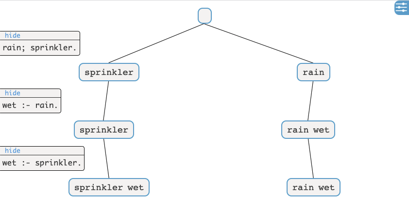

# viASP


**viASP visualizes an interactive explanation of your ASP program and its stable models**


viASP allows you to explore the visualization in a variety of ways:

* Toggle parts of the program
* Show the added symbols or all of them
* Inspect a single model
* Add `#show` statements on the fly
* Search models, signatures and rules.

To use viASP you don't have to change your ASP programs at all. You only have to execute them using the clingo python
API.

# Installation

`pip install viasp`
will install all necessary dependencies.

## Usage

### Overview

viASP has two parts, its frontend [Dash](https://dash.plotly.com) component and the backend server. To get everything
running, do the following:

1. `viasp` (or `viasp &` to run it in the background)
2. Start your dash app, a basic version can be found at [`examples/minimal_dash.py`](examples/minimal_dash.py)
3. Replace `clingo.Control` with `viasp.Control` in your python scripts and use `viasp.mark(model)` to select the models
   you want to show

### Quick start

If you don't have any scripts handy that use the python API of clingo, you can use our quickstart script.

**IMPORTANT** You will still need to start viasp (`viasp` or `viasp &`)

Then run [`examples/quickstart.py`](examples/quickstart.py). Modify the clingo program in there to your linking.

If you now run your ASP programs, you can inspect them using viASP at [http://127.0.0.1:8050/](http://127.0.0.1:8050/)
or what ever port you have set.

If you want to learn more about Dash, check out their [documentation](https://dash.plotly.com/layout).

## Limitations

viASP only works if you run your ASP programs using the python API, e.g.:

```python
from viasp import Control

program = """
rain; sprinkler.
wet :- rain.
wet :- sprinkler.
"""
ctl = Control(["0"])
ctl.add("base", [], program)
ctl.ground([("base", [])])
with ctl.solve(yield_=True) as handle:
    for model in handle:
        ctl.viasp.mark(model)
ctl.viasp.show()
```
